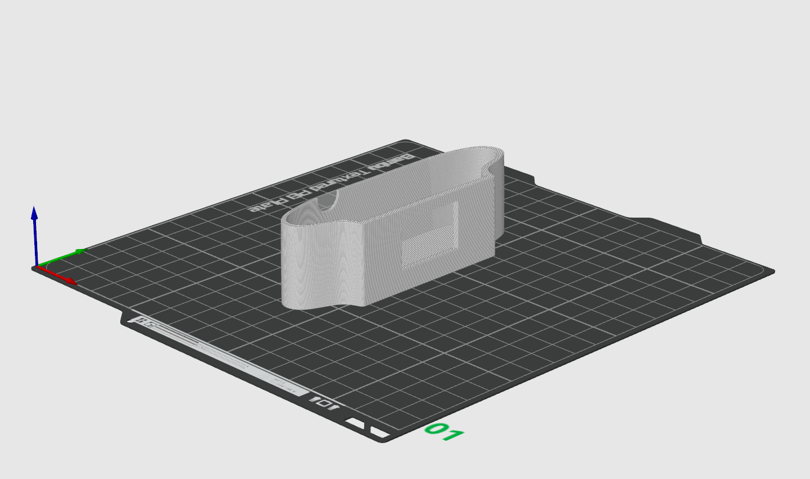
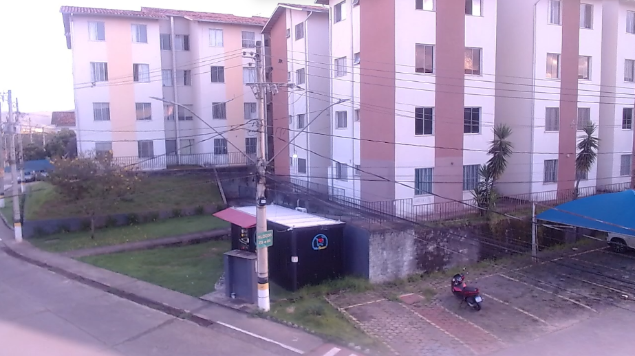
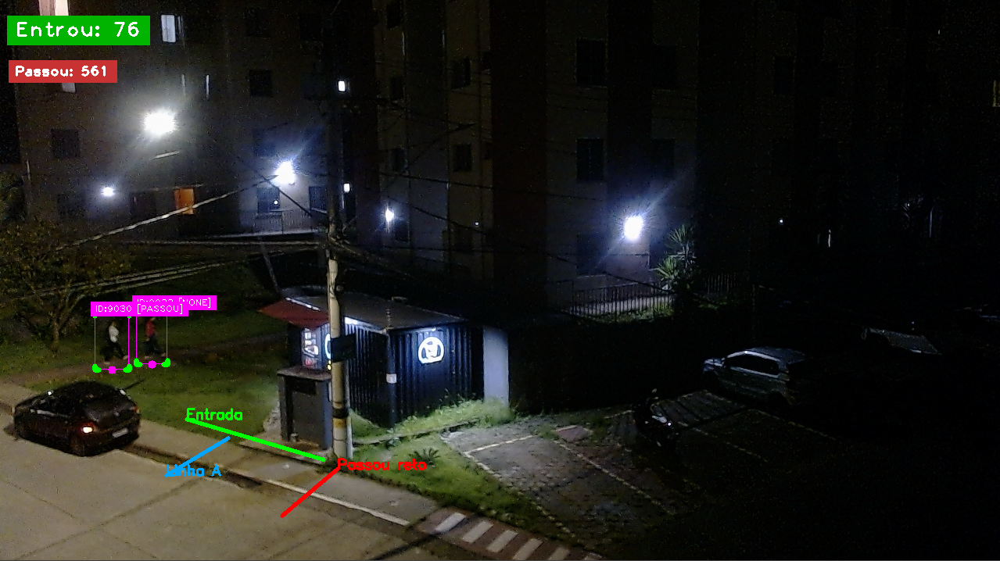

# 🛒 DeepMarket Tracker

> **Visão computacional aplicada ao varejo de bairro** — contagem inteligente de clientes em um mercadinho usando YOLOv8, tracking multi-objeto e análise de dados em tempo real.

---

<!-- IMAGEM: screenshot do sistema rodando em tempo real com as linhas e contadores -->


---

## 📖 A História do Projeto

Tudo começou com uma curiosidade simples: **quantas pessoas entram nesse mercadinho por dia?**

O estabelecimento fica em frente ao meu apartamento. Toda vez que olhava pela janela, me perguntava sobre o fluxo de clientes — nos horários de pico, nos dias de semana, à noite. Era uma dúvida genuína, sem nenhuma pretensão maior.

Um amigo meu, que já trabalhava com tecnologia, me ouviu falar sobre isso e disse: *"por que você não usa visão computacional pra isso?"* Ele me incentivou, deu apoio técnico nas fases iniciais e foi a faísca que precisava. A partir daí, o que era uma curiosidade casual virou um projeto completo de engenharia.

O resultado que você vê aqui: **76 entradas e 561 passantes em 24 horas** — de uma quarta para uma quinta-feira, das 17h às 17h.

---

## 🎯 Objetivo

Medir a **frequência de compra** e o **perfil de fluxo** de um pequeno varejo de bairro de forma autônoma, não-invasiva e de baixo custo, usando apenas uma câmera USB e hardware comum.

**KPIs coletados:**
| Métrica | Descrição |
|---|---|
| **Entradas** | Pessoas que efetivamente entraram no mercadinho |
| **Passantes** | Pessoas que passaram em frente mas não entraram |
| **Taxa de conversão** | `entradas / (entradas + passantes) × 100` |
| **Tempo de permanência** | Duração da visita do cliente na loja |
| **Fluxo por hora/turno** | Distribuição ao longo do dia |

---

## 🧠 Multidisciplinaridade do Projeto

Este projeto é um exemplo claro de que engenharia moderna exige múltiplas competências trabalhando juntas:

| Área | O que foi feito |
|---|---|
| **Visão Computacional** | Detecção de pessoas com YOLOv8 fine-tuned |
| **Machine Learning** | Coleta de dataset, rotulação, treinamento e avaliação |
| **Engenharia de Software** | Sistema de tracking, máquina de estados, persistência em banco |
| **Banco de Dados** | Modelagem Star Schema para análise OLAP e Power BI |
| **BI / Analytics** | Dashboard Streamlit + queries para Power BI |
| **Engenharia Mecânica / Design** | Modelagem 3D e impressão de case para câmera |
| **Eletrônica / Infraestrutura** | Posicionamento, alimentação e proteção do hardware externo |

---

## 🔩 Hardware & Case Impresso em 3D

Uma das partes mais interessantes e menos óbvias do projeto foi **ter que projetar e fabricar um suporte físico** para a câmera.

### Câmera: Logitech C920

A câmera utilizada é a **Logitech C920**, uma webcam de qualidade profissional com suporte a **1080p/30fps** e lente de vidro — ideal para captura externa com boa nitidez mesmo em condições de baixa luminosidade.

### O Problema: Ambiente Externo

A câmera precisa ficar posicionada em janela voltada para a rua, exposta a:
- ☀️ Luz solar direta
- 🌧️ Chuva e umidade
- 🌡️ Variações de temperatura

O suporte original da Logitech C920 não serve para esse tipo de instalação. A solução foi **projetar e imprimir um case customizado**.

### Solução: Modelagem + Impressão 3D

<!-- IMAGEM: foto do case impresso em PETG montado na janela com a câmera -->


<!-- IMAGEM: render 3D / foto do modelo CAD do case -->


**Material utilizado: PETG**
- Resistência à água e umidade
- Suporta temperatura elevada (sol direto)
- Mais durável que PLA para uso externo
- Boa adesão entre camadas para estruturas funcionais

> 📎 **O arquivo `.stl` do case está disponível neste repositório** para quem quiser replicar a instalação com a mesma câmera.
> 
> Arquivo: [`case_logitech_c920_externo.3mf`](./hardware/case_logitech_c920_externo.3mf)

---

## 📐 Arquitetura do Sistema

```
┌─────────────────────────────────────────────────────────────────────┐
│                        PIPELINE PRINCIPAL                           │
│                                                                     │
│  ┌──────────┐    ┌──────────┐    ┌──────────┐    ┌─────────────┐  │
│  │  Câmera  │───▶│  YOLOv8  │───▶│   SORT   │───▶│  Máquina   │  │
│  │ C920 USB │    │ fine-tune│    │ Tracker  │    │  de Estado  │  │
│  └──────────┘    └──────────┘    └──────────┘    └──────┬──────┘  │
│                                                          │         │
│                                              ┌───────────▼──────┐  │
│                                              │   PostgreSQL     │  │
│                                              │  (Star Schema)   │  │
│                                              └───────┬──────────┘  │
│                              ┌────────────────────────┤           │
│                    ┌─────────▼──────┐      ┌──────────▼────────┐  │
│                    │   Streamlit    │      │     Power BI      │  │
│                    │   Dashboard   │      │    Analytics      │  │
│                    └────────────────┘      └───────────────────┘  │
└─────────────────────────────────────────────────────────────────────┘
```

---

## 🔀 Máquinas de Estado

O coração da lógica de contagem é uma **máquina de estados por pessoa rastreada**. Cada `track_id` gerado pelo SORT possui seu próprio estado independente.

### Máquina de Estado: Pessoa Rastreada

```
                    ┌─────────────────────────────────────────┐
                    │             ESTADOS POSSÍVEIS           │
                    └─────────────────────────────────────────┘

              [Pessoa detectada pela 1ª vez]
                            │
                            ▼
                    ┌───────────────┐
                    │     NONE      │  ← Estado inicial
                    └───────┬───────┘
                            │
              [Cruza Linha A OU Linha B]
                            │
                            ▼
                    ┌───────────────┐
                    │  CANDIDATO   │  ← Pessoa na área de interesse
                    └───────┬───────┘
                            │
           ┌────────────────┼──────────────────┐
           │                │                  │
    [Cruza Linha         [Cruza Linha       [Desaparece sem
     Entrada →]          B apenas]         cruzar Entrada
           │                │               por 60 frames]
           ▼                ▼                   │
    ┌──────────────┐ ┌──────────────┐           │
    │   ENTROU    │ │    PASSOU    │◀──────────┘
    └──────┬───────┘ └──────────────┘
           │
    [Cruza Linha
     Entrada ←]
           │
           ▼
    ┌──────────────┐
    │     SAIU    │  ← Fecha sessão no banco (calcula permanência)
    └──────────────┘
```

### Máquina de Estado: Lógica das 3 Linhas

```
                    ┌────────────────────────────────────────────┐
                    │         LAYOUT DAS 3 LINHAS               │
                    └────────────────────────────────────────────┘

  [Rua / Calçada]
  ────────────────────────────────────────────────────────
       │               │                    │
   Linha A          Linha             Linha B
  (laranja)        Entrada           (vermelho)
                   (verde)

  ← sentido do pedestre que passa reto

  Lógica:
  • Linha A: detecta quem está se aproximando da bifurcação
  • Linha Entrada: confirma quem virou para o mercadinho (conta como ENTROU)
  • Linha B: confirma quem passou reto (conta como PASSOU)
  • A direção do cruzamento (±1) determina ENTRADA vs SAÍDA

<!-- IMAGEM: diagrama anotado da visão da câmera com as 3 linhas desenhadas -->

```

### Máquina de Estado: Sessão no Banco de Dados

```
         [Evento: ENTROU]
                │
                ▼
    ┌───────────────────────┐
    │  fato_sessao criado   │
    │  entrada_time = NOW() │
    │  converteu = TRUE     │
    └───────────┬───────────┘
                │
        [Sistema rodando...]
                │
        [Evento: SAIU]
                │
                ▼
    ┌─────────────────────────────────────┐
    │  fato_sessao atualizado             │
    │  saida_time = NOW()                 │
    │  tempo_permanencia_seg = EPOCH diff │
    └─────────────────────────────────────┘
```

---

## ⚠️ Desafio Principal: A Mureta de Oclusão

Esse foi o maior desafio técnico do projeto.

<!-- IMAGEM: foto ou screenshot destacando a mureta de oclusão na entrada do mercadinho -->


### O Problema

O mercadinho possui uma **mureta de alvenaria no meio da entrada**, dividindo o portão em duas passagens. Isso cria um **ponto cego** onde a câmera perde momentaneamente a visibilidade dos pedestres.

Consequências diretas:
1. **O tracker perde o ID** da pessoa no intervalo de oclusão
2. Quando a pessoa reaparece do outro lado, o SORT **atribui um novo ID**
3. A mesma pessoa físicamente pode ser contada **duas vezes**
4. Ou pior: entra como `CANDIDATO` e nunca cruza a linha de entrada registrada

### Soluções Implementadas

**1. Ajuste do `max_age` do SORT**
```python
tracker = Sort(
    max_age=100,       # 100 frames tolerados sem detecção (~3.3s a 30fps)
    min_hits=2,        # mínimo de detecções para criar track
    iou_threshold=0.15 # IoU baixo = mais tolerante a reposicionamento
)
```
O `max_age=100` permite que o tracker "aguarde" a pessoa reaparecer do outro lado da mureta antes de descartar o ID.

**2. Lógica de desaparecimento com timer**
```python
LIMIAR_DESAPARECIDO = 60  # ~2s a 30fps

# Se pessoa some como CANDIDATO por N frames → conta como PASSOU
if est["frames_sem_ver"] == LIMIAR_DESAPARECIDO and est["estado"] == "CANDIDATO":
    est["estado"] = "PASSOU"
    total_passou += 1
```

**3. Sistema de IDs já contados (idempotência)**
```python
ids_ja_contados_entrada = set()
ids_ja_contados_passou  = set()
```
Mesmo que o tracker (erroneamente) reatribua o mesmo ID, cada ID só é contado uma vez por conjunto.

> 💡 A mureta demonstra um princípio fundamental em visão computacional aplicada: **o ambiente físico nunca é cooperativo**. Soluções de tracking sempre precisam lidar com oclusão, e o design das linhas de contagem deve levar em conta o layout real do espaço.

---

## Modelo de Dados — Star Schema

```
                    ┌──────────────┐
                    │   dim_data   │
                    │  id_data PK  │
                    │  data        │
                    │  dia_semana  │
                    │  mes         │
                    │  ano         │
                    └──────┬───────┘
                           │
          ┌────────────────┼──────────────────┐
          │                │                  │
          ▼                ▼                  ▼
┌──────────────────┐ ┌─────────────┐ ┌───────────────────┐
│   fato_fluxo    │ │ fato_sessao │ │  resumo_horario   │
│  id_data FK     │ │  id_data FK │ │  id_data FK       │
│  id_hora FK     │ │  track_id   │ │  id_hora FK       │
│  track_id       │ │  entrada_time│ │  total_entradas   │
│  event_type     │ │  saida_time │ │  total_passantes  │
│  (ENTRADA/      │ │  permanencia│ │  taxa_conversao   │
│   SAIDA/        │ │  converteu  │ │  tempo_medio      │
│   PASSAGEM)     │ └─────────────┘ └───────────────────┘
│  direction      │
└──────────────────┘
          │
          ▼
┌──────────────┐
│   dim_hora   │
│  id_hora PK  │
│  hora (0-23) │
│  turno       │
└──────────────┘
```

---

## Dashboard

O dashboard (`dashboard.py`) exibe em tempo real:

- **Métricas de hoje**: Entradas, Lotação atual, Passantes, Tempo médio de permanência
- **Fluxo por hora**: Gráfico de linha com Entradas vs Passantes
- **Tendência diária**: Últimos 30 dias
- **Análise por turno**: Manhã / Tarde / Noite
- **Insights automáticos**: Taxa de conversão com sugestões contextuais

---

## 📁 Estrutura do Projeto

```
projetoIAmercadinho/
│
├── main.py                    # ← Pipeline principal: câmera → YOLO → SORT → banco
├── dashboard.py               # ← Dashboard Streamlit (analytics)
├── sort.py                    # ← Algoritmo SORT de tracking
│
├── banco/
│   ├── 01_schema.sql          # ← Criação das tabelas (Star Schema)
│   ├── 02_populate_dims.sql   # ← Popula dimensões (datas, horas)
│   ├── 03_migrate_data.sql    # ← Migração de dados legados
│   ├── 04_powerbi_queries.sql # ← Queries otimizadas para Power BI
│   └── run_setup.py           # ← Setup automático do banco
│
├── treinar_yolov8.py          # ← Treinamento do modelo customizado
├── extrair_frames.py          # ← Extração de frames dos vídeos de coleta
├── avaliar_modelo.py          # ← Avaliação de métricas do modelo
├── auto_rotular_yolo.py       # ← Auto-rotulação (Gemini Vision)
├── unificar_classes.py        # ← Unificação de labels do dataset
├── baixar_dataset.py          # ← Download do dataset do Roboflow
│
├── data.yaml                  # ← Configuração do dataset (formato YOLOv8)
│
├── hardware/
│   └── case_logitech_c920_externo.stl  # ← Case impresso em 3D (PETG)
│
├── Videos/                    # ← Vídeos de coleta de dados
├── Yolo-Weights/              # ← Pesos do modelo treinado
└── .env                       # ← Variáveis de ambiente (credenciais DB)
```

---

## 🚀 Como Executar

### Pré-requisitos

```bash
pip install ultralytics opencv-python cvzone psycopg2-binary streamlit plotly python-dotenv
```

### Configuração do Banco de Dados

1. Crie um banco PostgreSQL
2. Configure o `.env`:

```env
POSTGRES_HOST=localhost
POSTGRES_PORT=5432
POSTGRES_DB=deepmarket
POSTGRES_USER=postgres
POSTGRES_PASSWORD=sua_senha
```

3. Execute o setup:

```bash
python banco/run_setup.py
```

### Rodando o sistema de contagem

```bash
python main.py
```

Na primeira execução, uma janela interativa abrirá para você **desenhar as 3 linhas** clicando na imagem:

1. **Linha A** (laranja) — antes da bifurcação
2. **Linha Entrada** (verde) — acesso ao mercadinho  
3. **Linha B** (vermelho) — passagem reta

Pressione `R` para desfazer um ponto e `ENTER` para confirmar.

### Rodando o Dashboard

```bash
streamlit run dashboard.py
```

### Usando vídeo em vez da câmera

Em `main.py`, troque:
```python
cap = cv2.VideoCapture(0)  # webcam
# por:
cap = cv2.VideoCapture("Videos/seu_video.mp4")
```

---

## 🤖 Modelo de Detecção

### Dataset & Processo de Rotulação

O dataset foi construído de forma iterativa ao longo de vários experimentos:

- ~1.800 imagens extraídas de vídeos gravados no local com `extrair_frames.py` (1 frame a cada N para evitar redundância)
- Rotulação centralizada na plataforma **Roboflow**
- **Primeira tentativa**: auto-rotulação via **Gemini Vision API** — o limite de requisições gratuitas foi atingido antes de concluir, interrompendo o processo
- **Solução adotada**: rotulação manual no Roboflow — demorada, mas garantiu qualidade
- **Refinamento contínuo**: ao longo dos experimentos, continuamos usando a **mesma IA (Gemini)** para revisar e melhorar os labels existentes, corrigindo casos-limite e regiões de oclusão — cada ciclo de revisão gerava uma versão mais robusta do dataset

Esse processo de **loop humano + IA** foi fundamental para chegar nos resultados atuais.

### Evolução dos Experimentos

O modelo passou por múltiplas iterações de dataset e hiperparâmetros. Cada experimento foi numerado sequencialmente (ex: `mercadinho_experimento85`) e salvo separadamente para rastreabilidade.

### Treinamento (Experimento atual)

```
Hardware:   NVIDIA RTX 3060 (12 GB VRAM)
Modelo:     YOLOv8n (nano — velocidade > precisão, ideal para inferência em tempo real)
Épocas:     100
Duração:    ~31 minutos
Parâmetros: 3.006.038
GFLOPs:     8.1
```

### Resultados

```
Precision: 0.893   Recall: 0.870   mAP50: 0.921   mAP50-95: 0.551
```

---

## 🌙 Resultado: 24h de Operação (Qua 17h → Qui 17h)

<!-- IMAGEM: a imagem fornecida pelo usuário com o resultado das 24h -->


| Métrica | Valor |
|---|---|
| **Entradas** | 76 pessoas |
| **Passantes** | 561 pessoas |
| **Taxa de conversão** | ~11.9% |
| **Período** | 24h (Qua 17h → Qui 17h) |

> De cada 8 pessoas que passaram em frente ao mercadinho, **aproximadamente 1 entrou**.

---

## 🔧 Dificuldades Encontradas

| Dificuldade | Solução |
|---|---|
| **Oclusão da mureta** na entrada do mercadinho | Ajuste fino do `max_age` do SORT + lógica de desaparecimento com timer |
| Câmera em ambiente **externo** sem proteção | Modelagem e impressão 3D de case em PETG resistente à água e UV |
| Limite de créditos da API Gemini para auto-rotulação | Rotulação manual no Roboflow (~horas de trabalho manual) |
| `curl -L` do Roboflow não funciona no **PowerShell/Windows** | Substituído por `Invoke-WebRequest` |
| Dataset exportado no formato **COCO** por engano | Re-exportado no formato YOLOv8 correto |
| IDs "fantasmas" com `max_age` alto no SORT | Ajustado para `max_age=100` + `iou_threshold=0.15` |
| Pessoa contada duas vezes após reaparecer da oclusão | Sets de IDs já contados (`ids_ja_contados_entrada`, `ids_ja_contados_passou`) |

---

## 🛠️ Stack Tecnológica

| Tecnologia | Uso |
|---|---|
| **YOLOv8** (Ultralytics) | Detecção de pessoas |
| **SORT** | Tracking multi-objeto entre frames |
| **OpenCV** | Captura de vídeo, desenho e interface |
| **cvzone** | UI de bounding boxes |
| **PostgreSQL** | Banco de dados (Star Schema) |
| **psycopg2** | Conector Python → PostgreSQL |
| **Streamlit** | Dashboard analítico |
| **Plotly** | Gráficos interativos |
| **Python-dotenv** | Gerenciamento de variáveis de ambiente |
| **Roboflow** | Plataforma de dataset e rotulação |

---

## 📜 Licença

MIT — sinta-se livre para usar, modificar e distribuir.

---

<div align="center">

**Feito com curiosidade, café e uma câmera apontada pra rua. ☕**

*"O que a ciência dos dados pode dizer sobre um mercadinho de bairro?"*

</div>
