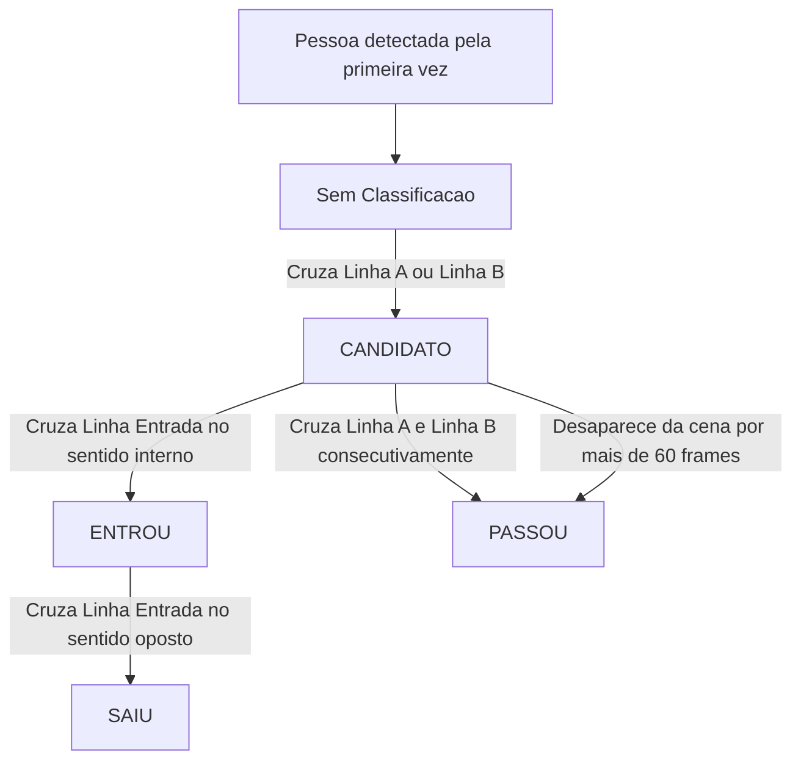
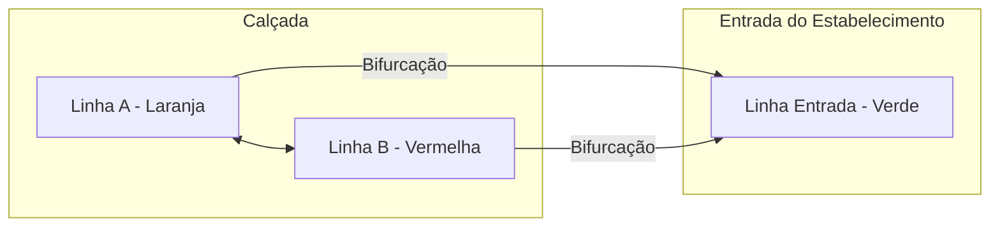

# DeepMarket Tracker

Visão computacional aplicada ao varejo de bairro: contagem inteligente de clientes em um mercado autônomo usando YOLOv8, tracking multi-objeto e análise de dados em tempo real.

---

### Sistema em operação (4x)

<video src="https://github.com/aguiarpedrof/DeepMarket-Tracker/raw/design-interface/.github/images/Video4x.mp4" controls="controls" muted="muted" style="max-width: 100%;">
  O vídeo está disponível em: <a href="https://github.com/aguiarpedrof/DeepMarket-Tracker/raw/design-interface/.github/images/Video4x.mp4">baixar vídeo</a>
</video>

<details>
<summary><b>Se o player não aparecer acima, clique aqui</b></summary>
<br>

O arquivo fonte está em: [`.github/images/Video4x.mp4`](https://github.com/aguiarpedrof/DeepMarket-Tracker/raw/design-interface/.github/images/Video4x.mp4)

</details>

> [!IMPORTANT]
> **Nota de Privacidade e Ética / Privacy & Ethics Notice**
>
> As imagens e vídeos apresentados neste repositório são utilizados exclusivamente para fins didáticos e acadêmicos. O sistema realiza apenas detecção e contagem de pessoas — não há qualquer intenção ou capacidade de identificação individual. Nenhum dado biométrico é coletado ou armazenado. Os vídeos originais utilizados para treinar a IA foram apagados após a conclusão do treinamento.
>
> All images and videos in this repository are used exclusively for educational and academic purposes. The system only performs people detection and counting — there is no intent or capability to identify individuals. No biometric data is collected or stored. The original training videos have been deleted after training was completed.

---

## Origem do Projeto

Este projeto nasceu de uma pergunta simples: quantas pessoas entram em um mercado autônomo de bairro por dia?

O estabelecimento fica localizado em frente ao meu apartamento. Observando o fluxo diário, surgiu a curiosidade de mensurar a taxa de atratividade desse modelo de negócio ao longo da semana e nos horários noturnos. A partir do apoio técnico inicial de um colega da área de visão computacional, estruturei um sistema de engenharia completo.

Os dados iniciais coletados revelaram 76 entradas e 561 passantes em um ciclo monitorado de 24 horas (de uma quarta-feira para uma quinta-feira, das 17h às 17h).

---

## Objetivos

Medir a frequência de compra e o perfil de fluxo de tráfego de um pequeno mercado local de forma autônoma, não-invasiva e de baixo custo, utilizando uma câmera estática comum e hardware acessível.

### Métricas coletadas (KPIs):

| Métrica | Descrição |
|---|---|
| **Entradas** | Quantidade de pessoas que efetivamente cruzaram a porta do mercado |
| **Passantes** | Quantidade de pedestres que circularam pela calçada mas não entraram |
| **Taxa de conversão** | Relação de atratividade da loja calculada como: `entradas / (entradas + passantes) * 100` |
| **Tempo de permanência** | Período de visita do cliente (planejado para versão futura com persistência em banco) |
| **Fluxo por hora e turno** | Distribuição de visitas ao longo do dia (planejado para versão futura com banco de dados) |

---

## Áreas Técnicas Desenvolvidas

Para o desenvolvimento deste sistema, foi necessária a integração de diferentes disciplinas de tecnologia e engenharia:

| Área | Escopo de Desenvolvimento |
|---|---|
| **Visão Computacional** | Detecção de pedestres através do YOLOv8 com fine-tuning localizado |
| **Machine Learning** | Coleta de dados, anotação de imagens, treinamento do modelo e validação |
| **Engenharia de Software** | Lógica de tracking de objetos, implementação de máquina de estados e geometria analítica |
| **Banco de Dados** | Modelagem dimensional Star Schema (planejada para futura integração) |
| **BI e Analytics** | Visualização interativa via painel Streamlit (planejada para futura integração) |
| **Modelagem e Design 3D** | Projeto e impressão de case físico para instalação externa da câmera (PETG) |
| **Infraestrutura física** | Posicionamento estático, cabeamento de dados e alimentação elétrica externa |

---

## Hardware e Case 3D para Câmera Externa

Para possibilitar a captura estável de imagens em diferentes condições climáticas (como sol forte ou chuvas intensas), projetei e fabriquei um suporte físico customizado.

### Especificação da Câmera
Foi utilizada uma câmera **Logitech C920**, operando em **1080p a 30 FPS** com lentes de vidro.

### Desafios de Ambiente Externo
A instalação da câmera em uma fachada exigia proteção contra:
* Radiação solar direta e calor acumulado
* Umidade e respingos de chuva
* Vento e trepidações mecânicas

### Solução com Impressão 3D


O suporte foi impresso em **PETG (Polietileno Tereftalato de Glicol)**. O material foi escolhido devido a sua excelente resistência a intempéries químicas, radiação UV e estabilidade térmica (superior ao PLA comum). 

O arquivo `.3mf` do projeto mecânico está aberto na pasta de hardware para quem desejar replicar:
* Arquivo físico: [`case_logitech_c920_externo.3mf`](./hardware/case_logitech_c920_externo.3mf)

---

## Arquitetura do Sistema

O processamento das imagens e a geração dos eventos seguem o pipeline de dados abaixo:


---

## Máquinas de Estado e Lógica de Contagem

O núcleo do sistema de inteligência de contagem opera através de uma máquina de estados aplicada individualmente a cada identificador único (`track_id`) gerado pelo tracker ByteTrack.

### Máquina de Estados da Pessoa Rastreada


```mermaid
flowchart TD
    A[Pessoa detectada pela primeira vez] --> B[Sem Classificacao]
    B -->|Cruza Linha A ou Linha B| C[CANDIDATO]
    
    C -->|Cruza Linha Entrada no sentido interno| D[ENTROU]
    C -->|Cruza Linha A e Linha B consecutivamente| E[PASSOU]
    C -->|Desaparece da cena por mais de 60 frames| E
    
    D -->|Cruza Linha Entrada no sentido oposto| F[SAIU]
```

### Layout de Linhas Geométricas

O layout utiliza três fronteiras lineares imaginárias configuradas na tela. A posição espacial (base da bounding box da pessoa) é avaliada em relação aos vetores de cada linha para determinar o sentido de deslocamento.


```mermaid
flowchart LR
    subgraph Calçada
        A[Linha A - Laranja] <--> B[Linha B - Vermelha]
    end
    subgraph Entrada do Estabelecimento
        C[Linha Entrada - Verde]
    end
    
    A -->|Bifurcação| C
    B -->|Bifurcação| C
```

* **Linha A (Laranja)**: Monitora a aproximação dos pedestres vindos de uma direção da calçada.
* **Linha B (Vermelha)**: Monitora a aproximação de pedestres vindos da direção oposta.
* **Linha de Entrada (Verde)**: Delimita o acesso físico ao interior do mercado.
* O sentido do cruzamento geométrico define se a pessoa está ingressando (contabilizado em entradas) ou passando de passagem (contabilizado em passantes).


---

## Desafio Técnico: Oclusão Física pela Mureta

Este representou o maior desafio técnico na implementação prática do algoritmo.


### O Problema
A entrada do mercado é dividida por uma mureta estrutural de alvenaria. Ao passar por trás dessa estrutura, a pessoa sofre oclusão total aos olhos da câmera por uma fração de segundo. 

Esse bloqueio visual gerava:
1. Perda da trajetória e do ID associado no tracker.
2. Atribuição de um ID inédito quando a pessoa reaparecia do outro lado da mureta.
3. Superestimação de contagens (dupla contagem da mesma pessoa).

### Soluções Aplicadas

1. **Migração para o ByteTrack**: 
Substituímos o tracker clássico SORT pelo ByteTrack. Este algoritmo mantém rastros de detecções mesmo com baixa confiança (como corpos parcialmente cobertos pela mureta) e consegue reassociar o mesmo ID de forma mais robusta quando a pessoa volta a aparecer por completo.

2. **Mecanismo de Timeout por Frame**:
Caso um ID classificado como `CANDIDATO` suma atrás da mureta e não reapareça após 60 frames (~2 segundos de tolerância física), o sistema consolida esse ID como `PASSOU` para evitar travamentos lógicos de estado.

3. **Garantia de Idempotência**:
Utilização de conjuntos (`Set`) na memória para registrar os identificadores únicos já contabilizados. Desta forma, mesmo se o tracker falhar em cenários extremos e reatribuir o ID antigo, a contagem é protegida de duplicações.

---

## Planejamento de Banco de Dados (OLAP)

Para suportar consultas históricas de BI e análise integrada no Power BI, estruturei o protótipo lógico abaixo baseado no padrão dimensional **Star Schema**:

```
                    ┌──────────────┐
                    │   dim_data   │
                    │  id_data PK  │
                    │  data        │
                    │  dia_semana  │
                    │  mes         │
                    │  ano         │
                    └──────┬───────┘
                           │
           ┌────────────────┼──────────────────┐
           │                │                  │
           ▼                ▼                  ▼
┌──────────────────┐ ┌─────────────┐ ┌───────────────────┐
│   fato_fluxo     │ │ fato_sessao │ │  resumo_horario   │
│  id_data FK      │ │  id_data FK │ │  id_data FK       │
│  id_hora FK      │ │  track_id   │ │  id_hora FK       │
│  track_id        │ │  entrada_time│ │  total_entradas   │
│  event_type      │ │  saida_time │ │  total_passantes  │
│  (ENTRADA/       │ │  permanencia│ │  taxa_conversao   │
│   SAIDA/         │ │  converteu  │ │  tempo_medio      │
│   PASSAGEM)      │ └─────────────┘ └───────────────────┘
│  direction       │
└──────────────────┘
          │
          ▼
┌──────────────┐
│   dim_hora   │
│  id_hora PK  │
│  hora (0-23) │
│  turno       │
└──────────────┘
```

---

## Estrutura de Diretórios

```
projetoIAmercadinho/
│
├── main.py                    # Script principal: YOLOv8s + ByteTrack + Máquina de Estados
├── treinar_yolov8.py          # Script simplificado para treinamento do modelo YOLOv8s
├── extrair_frames.py          # Script auxiliar para preparação e amostragem de dataset
├── data.yaml                  # Configurações de caminhos de validação e treino
│
├── hardware/
│   └── case_logitech_c920_externo.3mf  # Arquivo tridimensional de fabricação mecânica
│
└── Yolo-Weights/
    └── yolov8s.pt             # Pesos do modelo YOLO base
```

---

## Como Executar

### Pré-requisitos do Ambiente

Instale as dependências exigidas no seu interpretador Python:

```bash
pip install ultralytics opencv-python cvzone torch
```

### Inicialização do Sistema

```bash
python main.py
```

Na primeira inicialização de cada sessão de monitoramento, uma janela interativa solicitará que você marque as linhas de fronteira clicando na tela:
1. **Linha A** (laranja) - Calçada entrada
2. **Linha Entrada** (verde) - Porta física
3. **Linha B** (vermelha) - Calçada saída

Utilize a tecla `R` para reverter pontos marcados incorretamente e `ENTER` para confirmar e iniciar o processamento.

---

## Modelo de Detecção Customizado

### Processo de Rotulação do Dataset
O modelo de rede neural foi treinado iterativamente para se adaptar às características reais do ambiente de instalação:
* Amostragem de **2.051 imagens de treino** e **599 imagens de validação**.
* O dataset foi gerado a partir de vídeos locais no formato de frames independentes utilizando o script `extrair_frames.py`.
* A anotação das caixas delimitadoras foi gerida através do Roboflow.
* Adotamos um ciclo híbrido de revisão em que labels existentes foram auditados programaticamente com auxílio de modelos de linguagem visual para mitigar discrepâncias de anotação em cenários de oclusão.

### Parâmetros de Treinamento
* **Modelo**: YOLOv8s (Small) - Selecionado devido ao excelente equilíbrio entre velocidade de processamento na borda e acurácia geométrica em comparação ao modelo YOLOv8n (Nano).
* **Épocas**: 200
* **Otimizador**: AdamW (Learning Rate inicial: 0.001)
* **Aplicações de Augmentations**: Mosaic (100%), Flips horizontais de imagem (70%), variações adaptativas de brilho (hsv_v=0.6) e translações leves de escala.

### Métricas Alcançadas no Conjunto de Validação

```
Class   Images  Instances   Box(P)     R     mAP50  mAP50-95
all       599       723      0.911   0.884   0.928    0.577
```

| Métrica | Valor | Significado Prático |
|---|---|---|
| **Precision** | 0.911 | 91.1% das pessoas indicadas pelo modelo de fato existem |
| **Recall** | 0.884 | O modelo localiza 88.4% das pessoas reais presentes na cena |
| **mAP50** | 0.928 | Desempenho geral muito forte considerando os limites físicos do ambiente |

### Gráficos e Curvas de Desempenho


*Evolução consistente da perda em caixas (box_loss) e taxas de acerto da rede neural ao longo das épocas de treino, sem comportamento característico de overfitting.*

---


*Curva de Precision-Recall indicando mAP de 0.928 para IoU de 0.50, comprovando consistência sob variação de limiar.*

---


*Baixa incidência de falsos positivos na classe de detecção em relação ao fundo.*

---


*Distribuição espacial e dimensões relativas das caixas anotadas dentro do dataset real.*

---

## Resultados: Monitoramento de 24 Horas

Painel coletado após 24 horas de monitoramento contínuo (Quarta-feira, 17:00h às Quinta-feira, 17:00h):


| Métrica | Valor Absoluto |
|---|---|
| **Entradas Registradas** | 76 visitas |
| **Passantes Registrados** | 561 pedestres |
| **Taxa de Conversão Real** | Aproximadamente 11.9% |

---

## Dificuldades Técnicas e Soluções

| Problema Encontrado | Abordagem e Solução |
|---|---|
| **Oclusão temporária** pela mureta estrutural | Uso de tracking por ByteTrack, timeout estático e controle de idempotência por conjuntos |
| **Instalação desprotegida** em ambiente exterior | Projeto e fabricação mecânica de suporte customizado em PETG |
| **Erros de spawning** de threads do PyTorch no Windows | Configuração restrita de workers (`workers=0`) na rotina de treino |
| **Consistência de escala** no dataset Roboflow | Ajuste preventivo e re-exportação direta no padrão nativo do YOLOv8 |

---

## Stack Tecnológica

* **YOLOv8s** (Ultralytics): Modelo de detecção de objetos com fine-tuning local
* **ByteTrack**: Rastreamento persistente de múltiplos objetos
* **OpenCV**: Acesso a dispositivos de vídeo, processamento de matrizes e calibração de interfaces
* **cvzone**: Renderização acelerada de interfaces em tela
* **PyTorch e CUDA**: Aceleração por GPU para treino e inferência em tempo de execução
* **Roboflow**: Gestão de dados brutos e anotação colaborativa

---

## Licença

MIT
