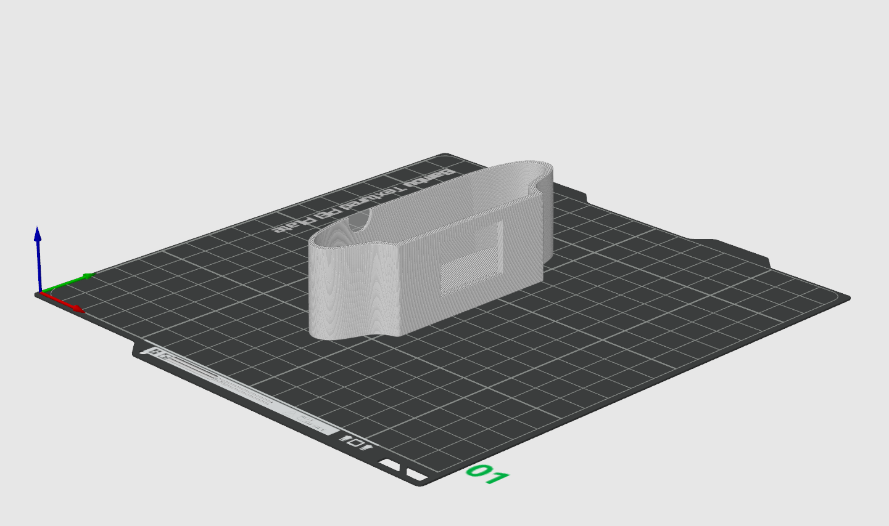
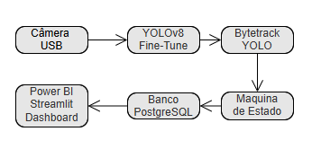
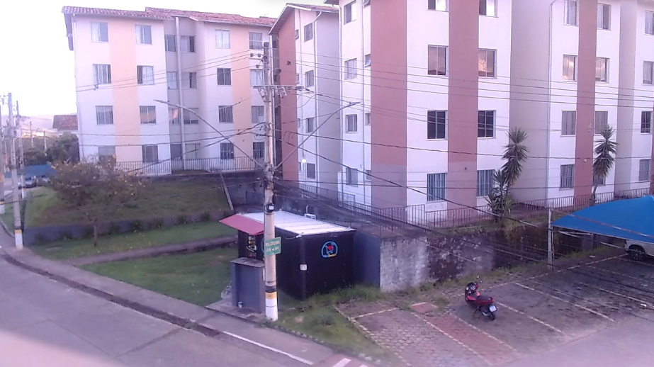
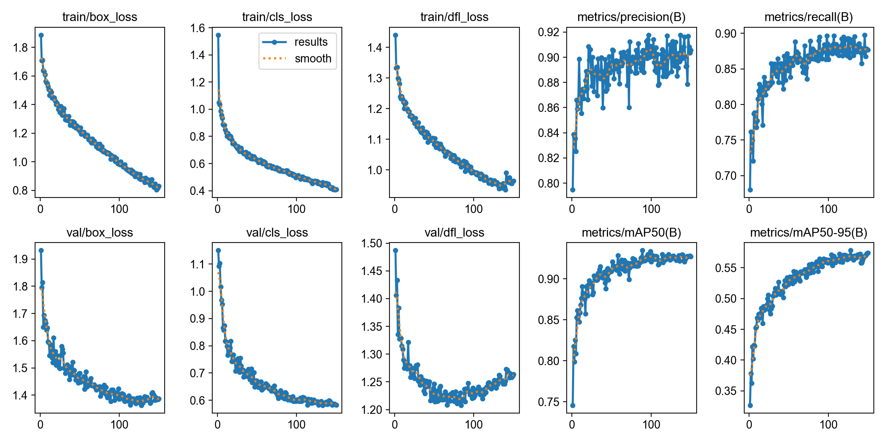
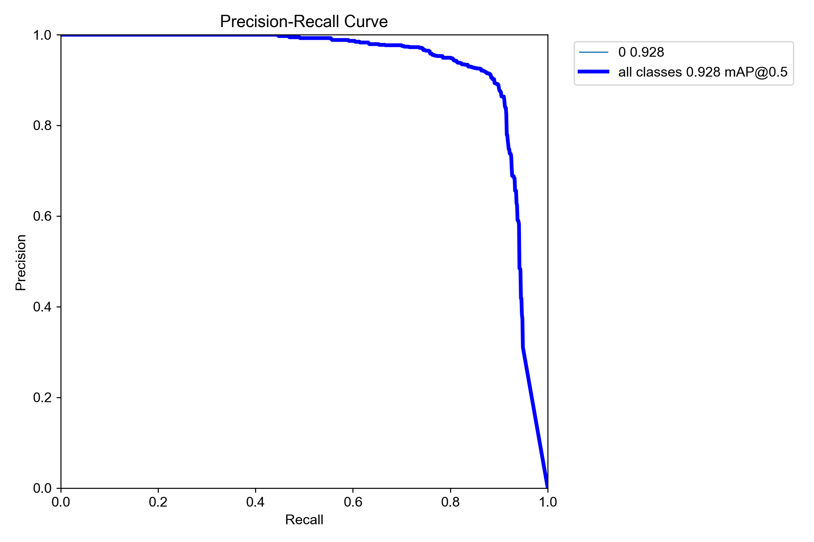
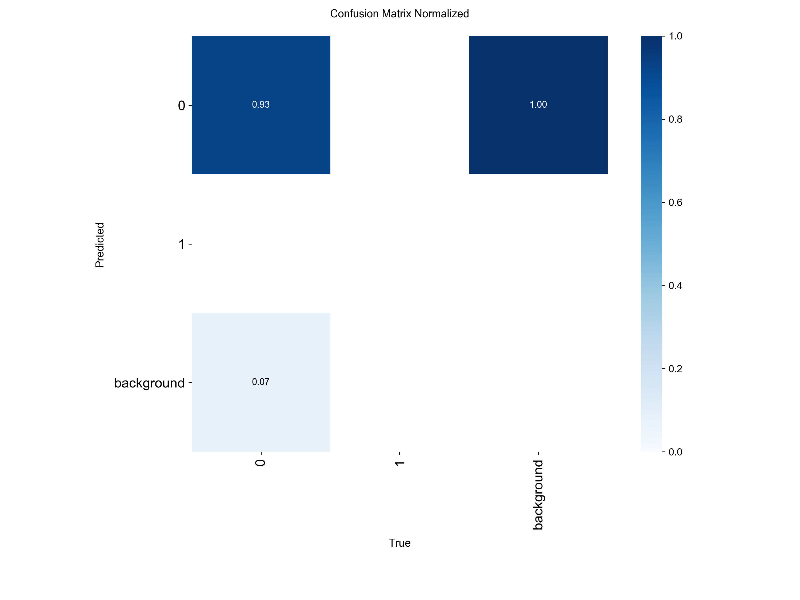
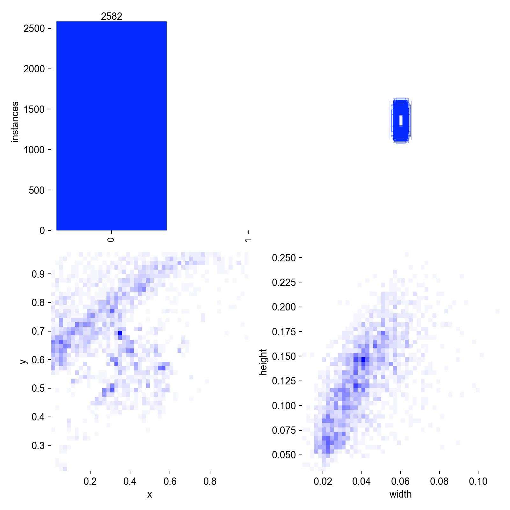
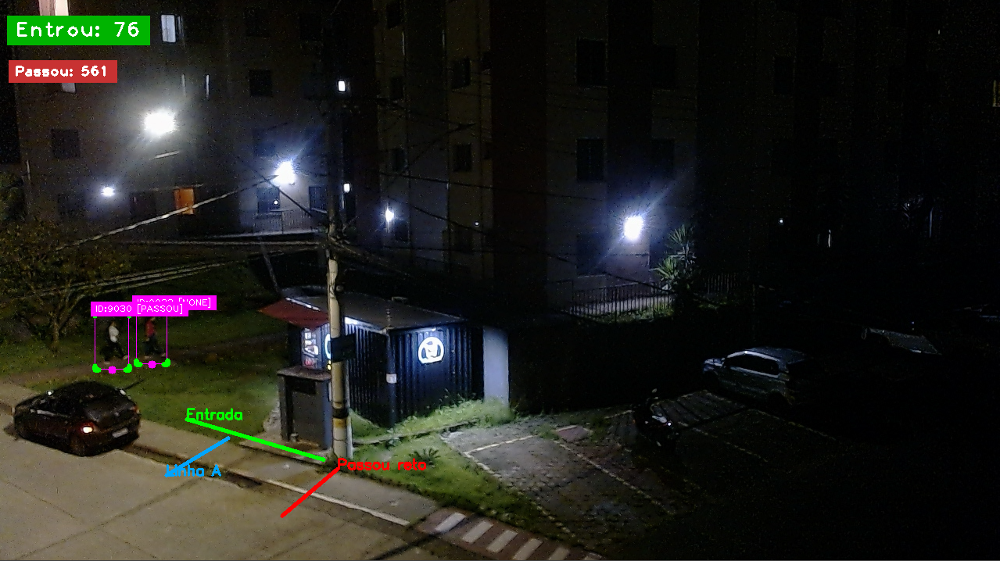

# 🛒 DeepMarket Tracker

> **Visão computacional aplicada ao varejo de bairro** — contagem inteligente de clientes em um mercado autônomo usando YOLOv8, tracking multi-objeto e análise de dados em tempo real.

---

### 📹 Sistema em operação — (4x)

<video src="https://github.com/aguiarpedrof/DeepMarket-Tracker/raw/design-interface/.github/images/Video4x.mp4" controls="controls" muted="muted" style="max-width: 100%;">
  O vídeo está disponível em: <a href="https://github.com/aguiarpedrof/DeepMarket-Tracker/raw/design-interface/.github/images/Video4x.mp4">baixar vídeo</a>
</video>

<details>
<summary>🔗 <b>Se o player não aparecer acima, clique aqui</b></summary>
<br>

O arquivo fonte está em: [`.github/images/Video4x.mp4`](https://github.com/aguiarpedrof/DeepMarket-Tracker/raw/design-interface/.github/images/Video4x.mp4)

</details>

> [!IMPORTANT]
> **⚖️ Nota de Privacidade e Ética / Privacy & Ethics Notice**
>
> 🇧🇷 As imagens e vídeos apresentados neste repositório são utilizados **exclusivamente para fins didáticos e acadêmicos**. O sistema realiza apenas **detecção e contagem de pessoas** — não há qualquer intenção ou capacidade de identificação individual. Nenhum dado biométrico é coletado ou armazenado. Os vídeos originais utilizados para treinar a IA **já foram apagados** após a conclusão do treinamento.
>
> 🇺🇸 All images and videos in this repository are used **exclusively for educational and academic purposes**. The system only performs **people detection and counting** — there is no intent or capability to identify individuals. No biometric data is collected or stored. The original training videos **have been deleted** after training was completed.

---

## O Início

Comecei esse projeto com um questionamento: **quantas pessoas entram nesse mercadinho por dia?**

O estabelecimento fica em frente ao meu apartamento. Toda vez me perguntava sobre o fluxo de clientes, nos dias de semana, à noite. Era uma dúvida genuína, sem nenhum objetivo.

Um amigo meu, que já trabalhava com YOLO, me incentivou, deu apoio técnico nas fases iniciais e foi a faísca que precisava. A partir daí, o que era uma curiosidade casual virou um projeto de engenharia.

O resultado que obtive foi: **76 entradas e 561 passantes em 24 horas** de uma quarta para uma quinta-feira, das 17h às 17h.

---

## Objetivos

Medir a **frequência de compra** e o **perfil de fluxo** de um pequeno mercado de bairro de forma autônoma, não-invasiva e de baixo custo, usando apenas uma câmera USB e hardware comum.

**KPIs coletados:**
| Métrica | Descrição |
|---|---|
| **Entradas** | Pessoas que efetivamente entraram no mercado |
| **Passantes** | Pessoas que passaram em frente mas não entraram |
| **Taxa de conversão** | `entradas / (entradas + passantes) × 100` |
| **Tempo de permanência** | Duração da visita do cliente na loja *(planejado para versão futura com banco de dados)* |
| **Fluxo por hora/turno** | Distribuição ao longo do dia *(planejado para versão futura com banco de dados)* |

---

## Multidisciplinaridade

Este projeto me exigiu que aprendesse novas competências:

| Área | O que foi feito |
|---|---|
| **Visão Computacional** | Detecção de pessoas com YOLOv8 fine-tuned |
| **Machine Learning** | Coleta de dataset, rotulação, treinamento e avaliação |
| **Engenharia de Software** | Sistema de tracking, máquina de estados, lógica de contagem |
| **Banco de Dados** | Modelagem Star Schema (planejada para versão futura) |
| **BI / Analytics** | Dashboard Streamlit (planejado para versão futura) |
| **Engenharia Mecânica / Design** | Modelagem 3D e impressão de case para câmera (PETG) |
| **Eletrônica / Infraestrutura** | Posicionamento, alimentação e proteção do hardware externo |

---

## Hardware & Case da Câmera Impresso em 3D

Uma das partes mais interessantes e menos óbvias do projeto foi **ter que projetar e fabricar um suporte físico** para a câmera, pois eu estava tendo muita dificuldade de pegar imagens para treinar em dias de chuva intensa e sol forte.

### Câmera: Logitech C920

A câmera utilizada é a **Logitech C920**, uma webcam de **1080p/30fps** e lente de vidro.

### O Problema: Ambiente Externo

A câmera precisava ficar posicionada em janela voltada para a rua, e isso a deixava exposta a:
- Luz solar direta
- Chuva e umidade
- Variações de temperatura

E daí veio a solução de **projetar e imprimir um case customizado**.

### Solução: Modelagem + Impressão 3D

<!-- IMAGEM: foto do case impresso em PETG montado na janela com a câmera -->
<!--  -->

<!-- IMAGEM: render 3D / foto do modelo CAD do case -->


**Material utilizado: PETG**
- Foi utilizado o material PETG pois ele tem uma ótima proteção contra chuvas e suporta altas temperaturas, fazendo dele o material ideal para a instalação externa. Também existe o ABS, que é mais eficaz contra chuva e temperaturas altas, mas devido ao limite de hardware da minha impressora, não foi possível utilizar o ABS.

> 📎 **O arquivo `.3mf` do case está disponível neste repositório** para quem quiser replicar a instalação com a mesma câmera.
>
> Arquivo: [`case_logitech_c920_externo.3mf`](./hardware/case_logitech_c920_externo.3mf)

---

## 📐 Arquitetura do Sistema



---

## 🔀 Máquinas de Estado

O coração da lógica de contagem é uma **máquina de estados por pessoa rastreada**. Cada `track_id` gerado pelo ByteTrack possui seu próprio estado independente.

### Máquina de Estado: Pessoa Rastreada

```
                    ┌─────────────────────────────────────────┐
                    │             ESTADOS POSSÍVEIS           │
                    └─────────────────────────────────────────┘

              [Pessoa detectada pela 1ª vez]
                            │
                            ▼
                    ┌───────────────┐
                    │  Sem Classif. │  ← Estado inicial
                    └───────┬───────┘
                            │
              [Cruza Linha A OU Linha B]
                            │
                            ▼
                    ┌───────────────┐
                    │  CANDIDATO    │  ← Pessoa na área de interesse
                    └───────┬───────┘
                            │
           ┌────────────────┼──────────────────┐
           │                │                  │
    [Cruza Linha         [Cruza Linha       [Desaparece sem
     Entrada →]          A e B]            cruzar Entrada
           │                │               por 60 frames]
           ▼                ▼                   │
    ┌──────────────┐ ┌──────────────┐           │
    │   ENTROU     │ │    PASSOU    │ ◀─────────┘
    └──────┬───────┘ └──────────────┘
           │
    [Cruza Linha
       Entrada ←]
           │
           ▼
    ┌──────────────┐
    │     SAIU     │  ← Exibe estado na tela (banco de dados planejado)
    └──────────────┘
```

### Máquina de Estado: Lógica das 3 Linhas

```
                    ┌────────────────────────────────────────────┐
                    │         LAYOUT DAS 3 LINHAS               │
                    └────────────────────────────────────────────┘

  [Rua / Calçada]
  ────────────────────────────────────────────────────────
       │               │                    │
   Linha A          Linha             Linha B
  (laranja)        Entrada           (vermelho)
                   (verde)

  ← sentido do pedestre que passa reto

  Lógica:
  • Linha A: detecta quem está se aproximando da bifurcação
  • Linha Entrada: confirma quem virou para o mercadinho (conta como ENTROU)
  • Linha B: confirma quem passou reto (conta como PASSOU)
  • A direção do cruzamento (±1) determina ENTRADA vs SAÍDA

<!-- IMAGEM: diagrama anotado da visão da câmera com as 3 linhas desenhadas -->

```

---

## ⚠️ Desafio Principal: A Mureta de Oclusão

Esse foi o maior desafio técnico do projeto.

<!-- IMAGEM: foto ou screenshot destacando a mureta de oclusão na entrada do mercadinho -->


### O Problema

O mercadinho possui uma **mureta de alvenaria no meio da entrada**, dividindo o portão em duas passagens. Isso cria um **ponto cego** onde a câmera perde momentaneamente a visibilidade dos pedestres.

Consequências diretas:
1. **O tracker perde o ID** da pessoa no intervalo de oclusão
2. Quando a pessoa reaparece do outro lado, o ByteTrack **pode atribuir um novo ID**
3. A mesma pessoa físicamente pode ser contada **duas vezes**
4. Ou pior: entra como `CANDIDATO` e nunca cruza a linha de entrada registrada

### Soluções Implementadas

**1. Uso do ByteTrack com re-associação robusta**
```python
results = model.track(imagem,
                      persist=True,
                      conf=0.30,
                      tracker="bytetrack.yaml")
```
O ByteTrack é superior ao SORT original para cenários de oclusão, pois mantém tracklets de baixa confiança e os reassocia quando a pessoa reaparece.

**2. Lógica de desaparecimento com timer**
```python
LIMIAR_DESAPARECIDO = 60   # ~2s a 30fps

# Se pessoa some como CANDIDATO por N frames → conta como PASSOU
if est["frames_sem_ver"] == LIMIAR_DESAPARECIDO and est["estado"] == "CANDIDATO":
    est["estado"] = "PASSOU"
    total_passou += 1
```

**3. Sistema de IDs já contados (idempotência)**
```python
ids_ja_contados_entrada = set()
ids_ja_contados_passou  = set()
```
Mesmo que o tracker (erroneamente) reatribua o mesmo ID, cada ID só é contado uma vez por conjunto.

> 💡 A mureta demonstra um princípio fundamental em visão computacional aplicada: **o ambiente físico nunca é cooperativo**. Soluções de tracking sempre precisam lidar com oclusão, e o design das linhas de contagem deve levar em conta o layout real do espaço.

---

## 🗄️ Banco de Dados (Trabalho Futuro)

A persistência de dados em banco é uma etapa planejada e já prototipada, **ainda não integrada na versão atual de produção**.

A modelagem adotada é um **Star Schema** para suportar análise OLAP e conexão com Power BI:

```
                    ┌──────────────┐
                    │   dim_data   │
                    │  id_data PK  │
                    │  data        │
                    │  dia_semana  │
                    │  mes         │
                    │  ano         │
                    └──────┬───────┘
                           │
          ┌────────────────┼──────────────────┐
          │                │                  │
          ▼                ▼                  ▼
┌──────────────────┐ ┌─────────────┐ ┌───────────────────┐
│   fato_fluxo    │ │ fato_sessao │ │  resumo_horario   │
│  id_data FK     │ │  id_data FK │ │  id_data FK       │
│  id_hora FK     │ │  track_id   │ │  id_hora FK       │
│  track_id       │ │  entrada_time│ │  total_entradas   │
│  event_type     │ │  saida_time │ │  total_passantes  │
│  (ENTRADA/      │ │  permanencia│ │  taxa_conversao   │
│   SAIDA/        │ │  converteu  │ │  tempo_medio      │
│   PASSAGEM)     │ └─────────────┘ └───────────────────┘
│  direction      │
└──────────────────┘
          │
          ▼
┌──────────────┐
│   dim_hora   │
│  id_hora PK  │
│  hora (0-23) │
│  turno       │
└──────────────┘
```

Quando implementado, permitirá:
- Registro do tempo de permanência por visita
- Dashboard Streamlit com fluxo por hora e turno
- Análise de tendências via Power BI

---

## 📁 Estrutura do Projeto

```
projetoIAmercadinho/
│
├── main.py                    # ← Pipeline principal: câmera → YOLOv8s → ByteTrack → tela
├── treinar_yolov8.py          # ← Treinamento do modelo customizado (YOLOv8s)
├── extrair_frames.py          # ← Extração de frames dos vídeos de coleta
│
├── data.yaml                  # ← Configuração do dataset (formato YOLOv8)
│
├── train/                     # ← Imagens e labels de treino (2.051 imagens)
├── valid/                     # ← Imagens e labels de validação (599 imagens)
├── test/                      # ← Imagens de teste
│
├── Yolo-Weights/              # ← Pesos base para fine-tuning (yolov8s.pt)
│
├── hardware/
│   └── case_logitech_c920_externo.3mf  # ← Case impresso em 3D (PETG)
│
└── .env                       # ← Variáveis de ambiente (futuro — credenciais DB)
```

---

## 🚀 Como Executar

### Pré-requisitos

```bash
pip install ultralytics opencv-python cvzone torch
```

### Rodando o sistema de contagem

```bash
python main.py
```

Na primeira execução, uma janela interativa abrirá para você **desenhar as 3 linhas** clicando na imagem:

1. **Linha A** (laranja) — antes da bifurcação
2. **Linha Entrada** (verde) — acesso ao mercadinho
3. **Linha B** (vermelho) — passagem reta

Pressione `R` para desfazer um ponto e `ENTER` para confirmar.

### Usando vídeo em vez da câmera

Em `main.py`, troque:
```python
cap = cv2.VideoCapture(0)  # webcam
# por:
cap = cv2.VideoCapture("Videos/seu_video.mp4")
```

### Treinando o modelo

```bash
python treinar_yolov8.py
```

O treino requer GPU (CUDA). Com RTX 3060 (12 GB), 200 épocas com YOLOv8s levam aproximadamente **1–2 horas**.

---

## 🤖 Modelo de Detecção

### Dataset & Processo de Rotulação

O dataset foi construído de forma iterativa ao longo de vários experimentos:

- **2.051 imagens de treino** + **599 de validação** extraídas de vídeos gravados no local
- Frames extraídos com `extrair_frames.py` (1 frame a cada N para evitar redundância)
- Rotulação centralizada na plataforma **Roboflow** (projeto `minismartunifei v3`)
- **Primeira tentativa**: auto-rotulação via **Gemini Vision API** — o limite de requisições gratuitas foi atingido antes de concluir, interrompendo o processo
- **Solução adotada**: rotulação manual no Roboflow — demorada, mas garantiu qualidade
- **Refinamento contínuo**: ao longo dos experimentos, continuamos usando a **mesma IA (Gemini)** para revisar e melhorar os labels existentes, corrigindo casos-limite e regiões de oclusão — cada ciclo de revisão gerava uma versão mais robusta do dataset

Esse processo de **loop humano + IA** foi fundamental para chegar nos resultados atuais.

### Evolução dos Experimentos

O modelo passou por múltiplas iterações de dataset e hiperparâmetros. Cada experimento foi numerado sequencialmente (ex: `mercadinho_experimento815`) e salvo separadamente para rastreabilidade.

A principal mudança nesta fase foi a **migração do YOLOv8n (nano) para o YOLOv8s (small)**, priorizando precisão em detrimento de velocidade — tradeoff adequado para câmera estática com apenas 1–2 pessoas visíveis por frame.

### Treinamento (Experimento atual — `mercadinho_experimento815`)

```
Hardware:   NVIDIA RTX 3060 (12 GB VRAM)
Modelo:     YOLOv8s (small — melhor equilíbrio precisão/velocidade para dataset médio)
Épocas:     200
Batch:      12 (AutoBatch a 60% VRAM)
Parâmetros: 11.136.374
GFLOPs:     28.6
Optimizer:  AdamW (lr=0.001)
Imagens:    2.051 treino | 599 validação
```

**Augmentations aplicadas:**
- Flip horizontal: 70% | Flip vertical: desativado
- Variação de brilho (hsv_v=0.6), saturação (hsv_s=0.8)
- Rotação leve (5°), translação (0.15), zoom (0.5)
- Mosaic: 100% | Mixup: desativado

### Resultados (conjunto de validação — 599 imagens, 723 instâncias)

```
Class   Images  Instances   Box(P)     R     mAP50  mAP50-95
all       599       723      0.911   0.884   0.928    0.577
0         510       723      0.911   0.884   0.928    0.577
```

| Métrica | Valor | Interpretação |
|---|---|---|
| **Precision** | 0.911 | 91.1% das detecções são corretas |
| **Recall** | 0.884 | 88.4% das pessoas reais são detectadas |
| **mAP50** | 0.928 | Excelente — IoU ≥ 0.50 |
| **mAP50-95** | 0.577 | Bom para dataset de câmera fixa em cena urbana |

**Velocidade de inferência:** 0.2ms pré-proc | 2.7ms inferência | 1.4ms pós-proc por imagem

---

### 📈 Gráficos de Treinamento

**Evolução das métricas durante as épocas**



*As curvas de loss (box, cls, dfl) de treino e validação convergem consistentemente sem divergência, indicando ausência de overfitting. As métricas de mAP50 e mAP50-95 crescem de forma estável ao longo das épocas, estabilizando em patamares altos.*

---

**Curva Precision-Recall**



*A curva PR é o padrão ouro em visão computacional. Com **mAP@0.5 = 0.928**, o modelo mantém alta precisão mesmo ao tentar recuperar a grande maioria dos objetos na cena — desempenho sólido para um dataset específico de câmera fixa em ambiente urbano.*

---

**Matriz de Confusão Normalizada**



*A matriz mostra que o modelo acerta **93% das detecções na classe alvo**, com apenas 7% classificado como background (falsos negativos). A baixa taxa de confusão valida a robustez do modelo para o caso de uso real.*

---

**Distribuição dos Labels (Análise Exploratória do Dataset)**



*Análise das anotações de treino: distribuição das bounding boxes e sua concentração espacial nas imagens. Confirma que o modelo foi treinado com boa variedade de posicionamentos — pessoas no centro, nas bordas e em diferentes escalas.*

---

## 🌙 Resultado: 24h de Operação (Qua 17h → Qui 17h)

<!-- IMAGEM: a imagem fornecida pelo usuário com o resultado das 24h -->


| Métrica | Valor |
|---|---|
| **Entradas** | 76 pessoas |
| **Passantes** | 561 pessoas |
| **Taxa de conversão** | ~11.9% |
| **Período** | 24h (Qua 17h → Qui 17h) |

> De cada 8 pessoas que passaram em frente ao mercadinho, **aproximadamente 1 entrou**.

---

## 🔧 Dificuldades Encontradas

| Dificuldade | Solução |
|---|---|
| **Oclusão da mureta** na entrada do mercadinho | ByteTrack com re-associação + timer de 60 frames para CANDIDATOS |
| Câmera em ambiente **externo** sem proteção | Modelagem e impressão 3D de case em PETG resistente à água e UV |
| Limite de créditos da API Gemini para auto-rotulação | Rotulação manual no Roboflow (~horas de trabalho manual) |
| `curl -L` do Roboflow não funciona no **PowerShell/Windows** | Substituído por `Invoke-WebRequest` |
| Dataset exportado no formato **COCO** por engano | Re-exportado no formato YOLOv8 correto |
| IDs "fantasmas" com tracker após oclusão | Sets de IDs já contados (`ids_ja_contados_entrada`, `ids_ja_contados_passou`) |
| Classe única (pessoa) com 2 labels no data.yaml | `nc=2` sobrescrito para `nc=2` (classes `'0'` e `'1'` — artefato do Roboflow) |

---

## 🛠️ Stack Tecnológica

| Tecnologia | Uso |
|---|---|
| **YOLOv8s** (Ultralytics) | Detecção de pessoas — fine-tuned no dataset local |
| **ByteTrack** (embutido no Ultralytics) | Tracking multi-objeto entre frames com re-associação robusta |
| **OpenCV** | Captura de vídeo, desenho e interface |
| **cvzone** | UI de bounding boxes e texto |
| **PyTorch + CUDA** | Aceleração GPU no treinamento e inferência |
| **Roboflow** | Plataforma de dataset e rotulação |
| **Python-dotenv** | Gerenciamento de variáveis de ambiente (futuro) |
| **PostgreSQL** *(planejado)* | Banco de dados Star Schema |
| **Streamlit** *(planejado)* | Dashboard analítico |
| **Plotly** *(planejado)* | Gráficos interativos |

---

## 🗺️ Roadmap

- [x] Detecção com YOLOv8 fine-tuned no ambiente real
- [x] Tracking com ByteTrack + máquina de estados
- [x] Contagem de entradas e passantes em tempo real
- [x] Case 3D em PETG para câmera externa
- [x] Interface interativa para definição das linhas
- [ ] Persistência em banco de dados PostgreSQL (Star Schema)
- [ ] Dashboard Streamlit com fluxo por hora, turno e dia
- [ ] Integração Power BI para análise histórica
- [ ] Registro de tempo de permanência por visita

---

## 📜 Licença

MIT — sinta-se livre para usar, modificar e distribuir.

---

<div align="center">

**Feito com curiosidade, café e uma câmera apontada pra rua. ☕**

*"O que a ciência dos dados pode dizer sobre um mercadinho de bairro?"*

</div>
