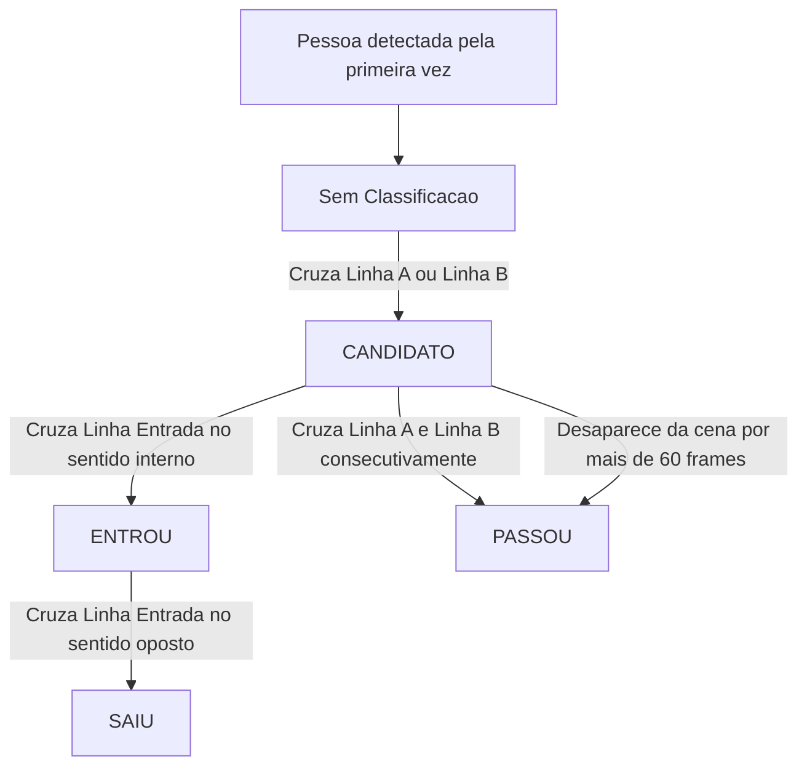
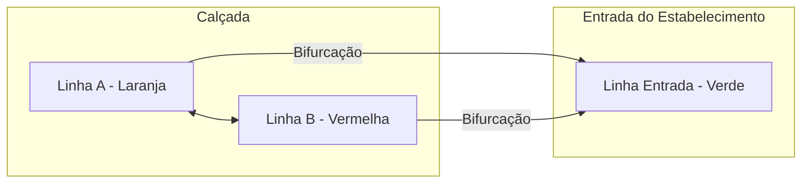

# 🧠 Discussões e Explicações (Explanation)

Este documento aprofunda os conceitos teóricos, as escolhas de design, os desafios de engenharia e o contexto histórico do **DeepMarket Tracker**.

---

## 📖 O Início e Motivação

O projeto nasceu de uma curiosidade casual e cotidiana: **quantas pessoas passam em frente ou de fato entram no mercadinho autônomo localizado em frente ao meu apartamento?**

O que começou como uma simples dúvida evoluiu para um projeto completo de engenharia multidisciplinar. O objetivo principal tornou-se mensurar o fluxo de clientes e a taxa de conversão do estabelecimento de forma automatizada, não-invasiva e de baixo custo, sem requerer a instalação de sensores físicos nas portas do comércio.

---

## 📐 Arquitetura da Pipeline de Visão

A pipeline de processamento de imagem do sistema é dividida em quatro camadas principais:

```
┌──────────────┐    ┌───────────────┐    ┌──────────────┐    ┌────────────────────┐
│ Captura      │───>│ Detecção      │───>│ Rastreamento │───>│ Máquina de Estados │
│ (OpenCV /    │    │ (YOLOv8s      │    │ (ByteTrack   │    │ & Lógica de        │
│  Webcam USB) │    │  Fine-Tuned)  │    │  Multi-Object│    │ Contagem           │
└──────────────┘    └───────────────┘    └──────────────┘    └────────────────────┘
```

1. **Captura**: Lê frames da câmera Logitech C920 ou de um arquivo de vídeo.
2. **Detecção**: O modelo YOLOv8s localiza bounding boxes da classe "pedestre".
3. **Rastreamento**: O ByteTrack associa as detecções entre frames adjacentes, mantendo um `track_id` único para cada indivíduo.
4. **Lógica de Contagem**: Uma máquina de estados analisa a trajetória do `track_id` em relação às 3 linhas de controle para incrementar as métricas de entradas e passantes.

---

## 🔀 A Máquina de Estados das Pessoas Rastreadas

Diferente de sistemas de contagem simples que apenas contam quando um ponto cruza uma linha (o que gera muitas contagens falsas se a pessoa oscilar sobre a linha), o DeepMarket Tracker utiliza uma **Máquina de Estados Finita (FSM)** individual para cada ID gerado pelo tracker.



---

## 📐 A Lógica de Geometria Espacial das 3 Linhas

O layout de 3 linhas virtuais resolve a ambiguidade espacial de quem está apenas passando pela rua versus quem de fato tomou a decisão de entrar no mercado.



- **Linha A (Laranja)**: Monitora a aproximação pelo lado esquerdo.
- **Linha B (Vermelho)**: Monitora a aproximação pelo lado direito.
- **Linha Entrada (Verde)**: Posicionada exatamente na entrada física da loja.

Ao cruzar a **Linha A** ou a **Linha B**, a pessoa entra no estado `CANDIDATO`. Se ela continuar caminhando pela calçada e cruzar a outra linha oposta (A e B cruzadas), ela é classificada como `PASSOU` (passante). Se a qualquer momento como candidato ela desviar e cruzar a **Linha Entrada**, é classificada como `ENTROU`.

---

## 🧱 O Desafio Técnico da Mureta de Oclusão

O ambiente físico real raramente é ideal para algoritmos de visão computacional. Neste projeto, o maior desafio foi uma **mureta de alvenaria na entrada do mercado** que obstrui a visão parcial das pernas e do corpo inferior dos pedestres por alguns frames.

### O Problema da Oclusão
Quando uma pessoa passa por trás da mureta, a câmera perde a detecção visual. Isso causa:
1. **Perda de Rastreamento**: O tracker assume que a pessoa desapareceu.
2. **Dupla Contagem**: Ao reaparecer do outro lado da mureta, o sistema gera um novo ID, contando a mesma pessoa novamente.

### Soluções Aplicadas

1. **Uso do ByteTrack**: Diferente do algoritmo SORT clássico, o ByteTrack mantém os rastros (tracklets) de objetos que sumiram temporariamente (baixa confiança) por um período de tempo, facilitando a re-associação quando o objeto ressurge com a mesma velocidade e direção.
2. **Timer de Desaparecimento (`LIMIAR_DESAPARECIDO = 60`)**: Se uma pessoa entra no estado `CANDIDATO` e some da tela por menos de 60 frames (~2 segundos), o sistema não a descarta imediatamente. Caso ela não reapareça após o tempo limite, ela é contabilizada por WDO (timeout) como `PASSOU`, evitando que o ID fique preso na memória ou gere falsas detecções tardias.
3. **Idempotência (Sets de Contagem)**: Mantemos conjuntos (`ids_ja_contados_entrada` e `ids_ja_contados_passou`) na memória. Uma vez que um ID específico incrementa um contador, ele não pode incrementar a mesma métrica novamente, mesmo que a máquina de estados oscile devido a falhas de detecção.

---

## 🤖 Escolha do Modelo: YOLOv8s vs YOLOv8n

Durante os experimentos de treinamento, avaliamos o modelo **YOLOv8n (Nano)** e o **YOLOv8s (Small)**.

Embora o YOLOv8n possua menor latência (~1ms de inferência) e consuma menos memória, o **YOLOv8s** foi escolhido para o ambiente de produção devido aos seguintes fatores:
- **Resolução Espacial**: O modelo Small possui quase o triplo de parâmetros (11.1M contra 3.2M da Nano), o que fornece maior capacidade de representação para pedestres pequenos no fundo da imagem e sob oclusão parcial (como pedestres atrás da mureta).
- **Métricas Superiores**: O mAP50 aumentou significativamente com o modelo Small.
- **Latência Aceitável**: Como a câmera é estática e o processamento é feito em hardware com GPU dedicada local (RTX 3060), o tempo de inferência de **2.7ms** da YOLOv8s é mais do que suficiente para manter a taxa de 30fps em tempo real.

---

## ⚖️ Nota de Privacidade e Ética (Ethics & Privacy)

Sistemas de visão computacional instalados em ambientes públicos exigem responsabilidade legal e ética:

- **Não-Identificação**: O sistema realiza detecção de objetos genéricos e tracking geométrico de caixas delimitadoras. Não há processamento de reconhecimento facial, análise de biometria ou qualquer técnica capaz de identificar unicamente um indivíduo.
- **Descarte de Imagens**: Os vídeos originais capturados para a fase de coleta e anotação do dataset foram **completamente apagados** após a conclusão do ciclo de treinamento do modelo. Nenhuma imagem de pedestre é transmitida para a nuvem ou armazenada permanentemente no hardware local.
- **Finalidade**: O uso dos dados coletados é estritamente estatístico e acadêmico, focado puramente em volumetria e comportamento de fluxo de varejo.
